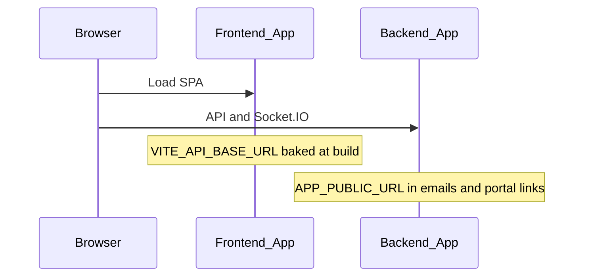

# Azure environment variable reference

Placeholder App Service names:

| App | URL |
|-----|-----|
| Frontend | `https://mudhro-agency-web.azurewebsites.net` |
| Backend | `https://mudhro-agency-api.azurewebsites.net` |

Replace with your actual hostnames.

## Cross-app wiring (deploy order)

1. Deploy **backend** with database and Blob configured; verify `GET /health`.
2. Deploy **frontend** with `VITE_API_BASE_URL` = backend URL (requires **rebuild** on every change).
3. Set backend `APP_PUBLIC_URL` and `SOCKET_CORS_ORIGIN` to the **frontend** URL.
4. Redeploy frontend if you change `VITE_API_BASE_URL`.



---

## Frontend App Service (`Mudhro_Agency_Frontend`)

| Name | Required | Example | Notes |
|------|----------|---------|--------|
| `VITE_API_BASE_URL` | Yes (prod) | `https://mudhro-agency-api.azurewebsites.net` | No trailing slash; **build-time only** — redeploy after change |
| `SCM_DO_BUILD_DURING_DEPLOYMENT` | Yes | `true` | Oryx runs `npm run build` |
| `WEBSITE_NODE_DEFAULT_VERSION` | Yes | `~20` | |
| `NODE_ENV` | Yes | `production` | |

---

## Backend App Service (`Mudhro_Agency_Backend`)

### Required for production

| Name | Example | Notes |
|------|---------|--------|
| `NODE_ENV` | `production` | |
| `DATABASE_URL` | `postgresql://user@server:pass@host.postgres.database.azure.com:5432/MudhroAgency?sslmode=require` | Azure PostgreSQL |
| `JWT_SECRET` | *(32+ random characters)* | Validation fails if shorter |
| `JWT_EXPIRES_IN` | `7d` | |
| `BCRYPT_SALT_ROUNDS` | `10` | |
| `APP_PUBLIC_URL` | `https://mudhro-agency-web.azurewebsites.net` | Emails and client portal links |
| `AZURE_STORAGE_CONNECTION_STRING` | `DefaultEndpointsProtocol=https;AccountName=...` | Agreements, chat, blob files |
| `AZURE_BLOB_CONTAINER` | `agencyuatfiles` | Create container in Storage Account |
| `SOCKET_CORS_ORIGIN` | `https://mudhro-agency-web.azurewebsites.net` | Comma-separated for multiple origins |

`PORT` is set by Azure automatically — do not override unless you know why.

### Strongly recommended

| Name | Example | Notes |
|------|---------|--------|
| `SMTP_HOST` | `smtp.gmail.com` | Empty = mail stubbed (not sent) |
| `SMTP_PORT` | `465` or `587` | |
| `SMTP_SECURE` | `true` or `false` | `true` for Gmail on 465 |
| `SMTP_USER` | your SMTP user | |
| `SMTP_PASS` | app password | Use App Service secret slot |
| `SMTP_FROM` | `invoices@yourdomain.com` | |
| `SMTP_FROM_NAME` | `Mudhro Agency` | |
| `UPLOAD_DIR` | `/home/uploads` | Invoice attachments; use mounted Azure Files in prod |
| `SCHEDULER_SECRET` | *(32+ chars)* | For Azure Timer `POST /api/internal/jobs/reminder-tick` |
| `SCM_DO_BUILD_DURING_DEPLOYMENT` | `true` | |
| `WEBSITE_NODE_DEFAULT_VERSION` | `~20` | |

### Scheduler modes

| Mode | Settings |
|------|----------|
| In-app cron (single instance) | `ENABLE_SCHEDULER=true` |
| Azure Timer (multi-instance safe) | `ENABLE_SCHEDULER=false`, `SCHEDULER_SECRET` set, timer POSTs to `/api/internal/jobs/reminder-tick` with header `x-scheduler-secret: <SCHEDULER_SECRET>` |

### Optional (defaults in code)

| Name | Default | Purpose |
|------|---------|---------|
| `FRONTEND_URL` | — | Agreement sign URL override (first priority) |
| `CLIENT_URL` | — | Agreement sign URL override (second) |
| `AZURE_BLOB_CONTAINER_SIGNATURES` | `signatures` | Legacy blob paths |
| `AZURE_BLOB_CONTAINER_AGREEMENTS` | `agreements` | Legacy blob paths |
| `INVOICE_NUMBER_PREFIX` | `INV` | |
| `INVOICE_NUMBER_PAD` | `5` | |
| `HASHIDS_SALT` | `JWT_SECRET` | Public ID encoding |
| `CHAT_RETENTION_DAYS` | `60` | |
| `CHAT_UPLOAD_MAX_MB` | `25` | |
| `CHAT_SAS_UPLOAD_TTL_MINUTES` | `15` | |
| `ENABLE_CHAT_AUDIT` | `false` | |
| `REDIS_URL` | — | Not used in application code today |

---

## SMTP examples

**Gmail (app password):**

```
SMTP_HOST=smtp.gmail.com
SMTP_PORT=465
SMTP_SECURE=true
SMTP_USER=you@gmail.com
SMTP_PASS=<google-app-password>
SMTP_FROM=invoices@yourdomain.com
SMTP_FROM_NAME=Mudhro Agency
```

**Mailgun:**

```
SMTP_HOST=smtp.mailgun.org
SMTP_PORT=587
SMTP_SECURE=false
SMTP_USER=postmaster@your-domain.mailgun.org
SMTP_PASS=<mailgun-smtp-password>
SMTP_FROM=invoices@yourdomain.com
SMTP_FROM_NAME=Mudhro Agency
```

---

## Azure Blob Storage

1. Create a Storage Account.
2. Create container `agencyuatfiles` (and optionally `signatures`, `agreements` for legacy paths).
3. Copy **Connection string** from Access keys → set `AZURE_STORAGE_CONNECTION_STRING`.

Features using Blob: agreements, signatures, chat uploads, expense PDFs, org/project/client file paths.

Invoice **attachments** use local `UPLOAD_DIR` (not Blob) unless migrated later.

---

## Azure Timer Function (reminder tick)

When `ENABLE_SCHEDULER=false`:

- **URL:** `POST https://mudhro-agency-api.azurewebsites.net/api/internal/jobs/reminder-tick`
- **Header:** `x-scheduler-secret: <SCHEDULER_SECRET>` (same value as App Setting)
- **Schedule:** e.g. every 5–15 minutes

Response: `{ "ok": true, "overdueUpdated": true, "remindersDispatched": N }`
